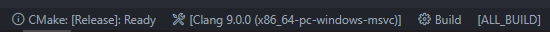

# Tutorial

*(if you notice any mistakes in this document feel free to let me know)*

This assumes you have at least some knowledge of C++. **You should not jump into GD Modding with little to no c++ or programming knowledge**. that is dumb bad idea.
You can follow online tutorials such as [learncpp](https://www.learncpp.com/) and others easily found on google on how to learn C++

This tutorial also makes use of CMake, which will be helpful to know about \
See https://cmake.org/cmake/help/latest/guide/tutorial/index.html for a tutorial

Note that this entire tutorial focuses on modding the game with C++ (mostly focusing on the Windows version, too), however, theoretically any language can be used, but specially those that can compile into native binaries and interact with low level mechanics, such as C, Rust, Zig or even straight up ASM.

- [How do mods work](#how-do-mods-work)
    - [Mods in the future](#mods-in-the-future)
- [Setup](#setup)
- [Your first DLL](#your-first-dll)
- [Setting up libraries](#setting-up-libraries)
- [Creating a hook](#creating-a-hook)
    - [Calling conventions](#calling-conventions)
    - [Calling conventions in practice](#calling-conventions-in-practice)
- [Your first Cocos2d-x layer]()
- [Working with the gd classes]()
- [Understanding assembly]()
- [Reverse engineering]()
    - [Depression]()

# How do mods work

Geometry Dash is a game written in C++ using the Cocos2d-x framework. Like many c++ applications, it's natively compiled, meaning you can't just edit some nice and neat source code thats available, instead all you have is assembly, which is what your cpu runs.

So how can you mod the game if there's no official tools or public source code? The answer is pain. lots of it. Just kidding! it is done with methods such as injection, patching and hooking. So first, **what is injection**?

> DLL injection is a technique used for running code within the address space of another process by forcing it to load a dynamic-link library. DLL injection is often used by external programs to influence the behavior of another program in a way its authors did not anticipate or intend. \
[*From: https://en.wikipedia.org/wiki/DLL_injection*](https://en.wikipedia.org/wiki/DLL_injection)

Well, basically it's *injecting* our own code into another process via dynamic libraries, such as .dll files on Windows. This is sort of what mods do, except there is no other process involved, it's all done in gd.

**What is patching**? Patching, or in this context, binary patching is modifying existing bytes. It can be either done in memory, meaning its temporary, or it can be done by directly editing the game's executable, thus making the change persistent

**What is hooking**? 

> The term hooking covers a range of techniques used to alter the behaviour of software by **intercepting** function calls or messages or events passed between software components. Code that handles such intercepted function calls, events or messages is called a hook. \
Runtime function hooking can be implemented by changing the very first few code instructions of the target function to jump to an injected code. \
[*From: https://en.wikipedia.org/wiki/Hooking*](https://en.wikipedia.org/wiki/Hooking)

In short, it's basically redirecting a target function, so that whenever it gets executed it'll run our own code, which is called the hook. On native code this works by overwriting the assembly code at the start of the target function. In GD modding this is essentially what allows 90% of the stuff to happen, since it lets you add on to what's already in the game.

Mods are usually distributed as dynamic libraries (with file extensions such as `.dll` on Windows, `.dylib` on MacOS and `.so` on Android), and loaded through [mod loaders](). Mod loaders and DLL Injectors are quite similar, they can load arbitrary libraries, although injectors work externally to the process, while mod loaders are in the target process.

## Mods in the future

This repo shows the process of making a mod for windows which involves gd.h + cocos-headers + minhook, however, tools and SDKs such as [lilac](https://github.com/lilac-sdk), [hyperdash](), [Cacao](https://github.com/camila314/CacaoSDK) and [poweredbypie](https://poiweredbypie) intend to provide a much better experience in modding, and reducing conflicts between mods. At the time of writing this there are no usable SDKs for windows, however there are some utility libraries to facilitate the hooking process, such as [mat-dash](https://github.com/matcool/mat-dash/)

# Setup

There are many C++ compilers out there, but there are really only two viable options for windows: Microsoft Visual C++ Compiler and Clang. Robtop himself uses MSVC for windows, however clang is abi compatible with msvc so you can use it as well, but note you will still need some of the windows sdk which you can get with the Visual Studio Build Tools

| Name | Download |
|-|-|
| Visual Studio | https://visualstudio.microsoft.com/downloads/ |
| VS Build Tools | https://visualstudio.microsoft.com/downloads/#build-tools-for-visual-studio-2019 |
| Clang | https://releases.llvm.org/download.html |
| CMake | https://cmake.org/download/ |

## Visual Studio

Download the visual studio installer, run it, install the thing that is needed (? i need some reference images for this part but also dont want to have to reinstall visual studio for it), create a new project that is the dll one or whatever

(? man do i really want to do a tutorial for visual studio i forgot how to use it entirely im much more used to cmake

## Visual Studio Code

For vscode it's definitely more recommended to use CMake with either compiler, along with the CMake Tools extension and C++ extension for intellisense. To compile a CMake project first open it in vscode and look for the cmake buttons on the bottom bar. In there you can change the build config, the compiler and target.



For windows mods it is recommended to use Release mode, due to Debug mode having size differences in stl containers. Also for MSVC make sure to switch to the x86 one.

# Your first DLL

*almost everything from now on is windows specific*

Create a new folder for your project and there create a file called `CMakeLists.txt`, there put
```cmake
cmake_minimum_required(VERSION 3.0)

# feel free to rename this to whatever you want
# but of course make sure to replace it everywhere else as well
project(my-project)

# here create the library and make it shared, thus creating our dll
add_library(my-project SHARED main.cpp)
```
The `main.cpp` in the add_library call is the source file, which you should also create

> ### Note for Clang
> 
> Clang defaults to 64 bit, so to change it you must add a compiler option
> ```cmake
> if (${CMAKE_CXX_COMPILER_ID} STREQUAL Clang)
>   # ensure 32 bit on clang
>   set(CMAKE_SIZEOF_VOID_P 4)
>   set(CMAKE_C_FLAGS "${CMAKE_C_FLAGS} -target i386-pc-windows-msvc")
>   set(CMAKE_CXX_FLAGS "${CMAKE_CXX_FLAGS} -target i386-pc-windows-msvc")
>   add_definitions("--target=i386-pc-windows-msvc")
> endif()
> ```

Whenever dlls get loaded, their [DllMain](https://docs.microsoft.com/en-us/windows/win32/dlls/dllmain) entrypoint is called, so here we use it to create another thread to execute our code in, as [many functions are considered unsafe](https://docs.microsoft.com/en-us/windows/win32/dlls/dynamic-link-library-best-practices) to run in DllMain.

See [https://docs.microsoft.com/en-us/windows/win32/dlls/dllmain](https://docs.microsoft.com/en-us/windows/win32/dlls/dllmain) for more info

```cpp
#include <Windows.h>

DWORD WINAPI myThread(void* instance) {
    MessageBoxA(NULL, "Hello, world", "An interesting title", MB_OK);

    return 0;
}

BOOL WINAPI DllMain(HINSTANCE instance, DWORD reason, LPVOID) {
    if (reason == DLL_PROCESS_ATTACH) {
        auto handle = CreateThread(NULL, 0, &myThread, instance, 0, NULL);
        if (handle) CloseHandle(handle);
    }
    return TRUE;
}
```

Now, when injecting this dll into gd or loading it through a mod loader, it should create a message box as soon as it gets loaded.

# Setting up libraries

Now that you have a basic dll working, you can start integrating community made libraries to interact with gd such as
- **[gd.h](https://github.com/poweredbypie/gd.h)**: Provides reversed class structures and function calls
- **[cocos-headers](https://github.com/HJfod/cocos-headers/)**: Based off official cocos2d headers, but modified to match with rob's own cocos2d version

Note for gd.h: You may notice the repo hasn't been updated in a few months, so you may want to use the way more up to date but "experimental" [hjfod fork](https://github.com/hjfod/gd.h) (experimental as in stuff may change and or break)

In this example I will be cloning the repos into a folder named `libraries` resulting in this file structure so far
```
libraries/
 ├ cocos-headers/
 └ gd.h/
CMakeLists.txt
main.cpp
```

In order to add these libraries to your project you must edit your CMake file to include them

```cmake
# ...

target_include_directories(my-project PRIVATE
  libraries/gd.h
  libraries/gd.h/include
)

add_subdirectory(libraries/cocos-headers)

target_link_libraries(my-project cocos2d)

# ...
```

Now in our `main.cpp` code we can do

```cpp
// ...

#include <cocos2d.h>

DWORD WINAPI myThread(void*) {
    cocos2d::CCDirector::sharedDirector()->setTimeScale(0.5f);

    return 0;
}

// ...
```

But please note that running cocos2d/gd functions in another thread is very unsafe, most will likely crash as almost nothing is thread safe. This is why gd is a single thread game, except for the http requests.

# Creating a hook

In this tutorial we'll be focusing on using **MinHook**, but other libraries can work too.

So first clone it from [https://github.com/TsudaKageyu/minhook/](https://github.com/TsudaKageyu/minhook/), I'll be putting it in the libraries folder together with gd.h and cocos-headers

```
libraries/
 ├ cocos-headers/
 ├ gd.h/
 └ minhook/
CMakeLists.txt
main.cpp
```

And in the `CMakeLists.txt` file

```cmake
# ...

target_include_directories(my-project PRIVATE
  libraries/gd.h
  libraries/gd.h/include
  libraries/minhook/include
)

add_subdirectory(libraries/cocos-headers)
add_subdirectory(libraries/minhook)

target_link_libraries(my-project cocos2d minhook)

# ...
```

Using MinHook consists of mostly three parts: initializing it, creating the hooks and then enabling them. You should initialize minhook before doing anything, and only once throughout the entire program.

```cpp
#include <MinHook.h>

DWORD WINAPI myThread(void*) {
    MH_Initialize();

    // ...
}
```
> Most MinHook functions return a `MH_STATUS` enum, which if you want to you can check this way
> ```cpp
> auto status = MH_Initialize();
> if (status != MH_OK) {
>     MessageBoxA(NULL, MH_StatusToString(status), "An error ocurred while initializing minhook", MB_OK | MB_ICONWARNING);
> }
> ```

Now, for creating and enabling the hook we use the `MH_CreateHook` and `MH_EnableHook` functions, which are defined as
```cpp
MH_STATUS MH_CreateHook(void* pTarget, void* pDetour, void** ppOriginal);
MH_STATUS MH_EnableHook(void* pTarget);
```

Note that the hook and the original signature must match the target function, including the [calling convention](#calling-conventions).

> To recap on how hooks work, here's this example code showing the usual behaviour of hooks:
> ```cpp
> void target() {
>     printf("hello world\n");
> }
>
> void(*original)();
> void hook() {
>     printf("bad world!!\n");
>     original();
>     printf("gah\n");
> }
>
> int main() {
>     MH_Initialize();
>
>     MH_CreateHook(
>         reinterpret_cast<void*>(&target),
>         reinterpret_cast<void*>(&hook),
>         reinterpret_cast<void**>(&original)
>     );
>
>     // can also be MH_EnableHook(reinterpret_cast<void*>(&target));
>     // instead this just enables all created hooks so far
>     MH_EnableHook(MH_ALL_HOOKS);
>
>     target();
> }
> ```
> The code above should have this output
> ```
> bad world!!
> hello world
> gah
> ```

## Calling conventions

Before we get to hooking gd functions, we must understand calling conventions.

> In computer science, a calling convention is an implementation-level (low-level) scheme for how subroutines receive parameters from their caller and how they return a result. \
> From: https://en.wikipedia.org/wiki/Calling_convention

Basically it's how, at the low level, functions receive arguments. This is usually something you don't worry about in your own code, but it's important to know when interfacing with external code, such as code in an already compiled executable in gd.

This is only something you have to deal with on Windows gd, as it's compiled to 32 bit (x86), other platforms such as macOS (x86_64 System V ABI), Android (ARM32) and iOS (ARM64) all have a single and well defined calling convention, while x86 has many calling conventions (See [https://en.wikipedia.org/wiki/X86_calling_conventions](https://en.wikipedia.org/wiki/X86_calling_conventions)).

Since gd functions aren't meant to be called externally, the compiler is free to optimize them. The optimized calling convention used by MSVC is an undocumented calling convention based off their [x64 calling convention](https://en.wikipedia.org/wiki/X86_calling_conventions#Microsoft_x64_calling_convention), similar to vectorcall, and for this reason many call it `optcall`. There are exceptions to this, mostly virtual methods, and also methods passed in to cocos2d, such as selectors, which are always `thiscall`.

To explain it in short: ECX and EDX are used for the 1st and 2nd argument if they are less than or equal to 4 bytes in size, the rest of the arguments go into the stack from right to left. This is the same as fastcall, except for floats (? and doubles?) which go into the XMM0 through XMM3 registers depending on their argument index

### optcall
| index | location | location if float |
|-|-|-|
| 0 | ECX or stack | XMM0 |
| 1 | EDX or stack | XMM1 |
| 2 | stack | XMM2 |
| 3 | stack | XMM3 |
| >=4 | stack | stack |

There is also a variation of this calling convention which is used for member functions that skips the EDX register, which is sometimes called `membercall`

### membercall
| index | location | location if float |
|-|-|-|
| 0 (this) | ECX |  |
| 1 | stack | XMM1 |
| 2 | stack | XMM2 |
| 3 | stack | XMM3 |
| >=4 | stack | stack |

## Calling conventions in practice

In practice, most functions you deal with in hooking are interchangeable with `thiscall`, which is when they are member functions and don't have any floating point arguments, or the exceptions mentioned previously

Take for example `bool PlayLayer::init(GJGameLevel*)`. It's a member function with no float arguments, meaning it can be expressed as
```cpp
bool __thiscall PlayLayer_init(PlayLayer* this, GJGameLevel* level) {
    // ...
}
```
However there are two issues with using this as a hook method: Using `this` as a variable name since its a C++ keyword, but also using `__thiscall`. This is only an issue in MSVC, Clang lets you use `__thiscall` anywhere. A workaround for this is to emulate it using the fastcall calling convention, since it's similar to thiscall but uses the EDX register for the second argument.

```cpp
// This only works on clang, due to msvc being a bitch about it
// or i mean it doesnt like it when you use it outside class/structs
void __thiscall foo(T* self, A bar, B baz, ...) {

}

// the two below should be the equivalent to the above

// void* since thats the size of a pointer, which is also the size of the EDX register
void __fastcall foo(T* self, void* edx, A bar, B baz, ...) {
    
}

// There's also another option, recently found by pie

// the name of the struct doesnt matter
struct Hooks {
    static void __thiscall foo(T* self, A bar, B baz, ...) {

    }
};
```

So going back to the example of `PlayLayer::init`, here is how you could do it

```cpp
bool __fastcall PlayLayer_init(PlayLayer* self, void*, GJGameLevel* level) {
    // ...
}
// or
struct Hooks {
    static bool __thiscall PlayLayer_init(PlayLayer* self, GJGameLevel* level) {
        // ...
    }
};
```

---

Now, time to hook one of gd's functions, for this example lets choose `void MenuLayer::onMoreGames(cocos2d::CCObject*)`. Not only does this function not contain any float arguments, but it's also a cocos2d selector, meaning we don't have to deal with optcall shenanigans. \
As shown before, with the way MinHook works you must also save a pointer to the [trampoline](https://en.wikipedia.org/wiki/Trampoline_%28computing%29) function. For these you must also deal with the calling convention, but they can be set to `__thiscall` on either compiler.

```cpp
// the _H suffix is a way of distingushing between the hook and the trampoline
// you can choose them to be anything you want, as function names don't affect how hooks work
void (__thiscall* MenuLayer_onMoreGames)(MenuLayer*, cocos2d::CCObject*);
void __fastcall MenuLayer_onMoreGames_H(MenuLayer* self, void*, cocos2d::CCObject* sender) {
    // here we are calling the trampoline, executing the code
    // of the target function, while also being able to run our own code afterwards/before
    MenuLayer_onMoreGames(self, sender);
    MessageBoxA(NULL, "MenuLayer::onMoreGames has been called", "info", MB_OK);
}

DWORD WINAPI myThread(void*) {
    MH_Initialize();

    MH_CreateHook(
        reinterpret_cast<void*>(&???), // target
        reinterpret_cast<void*>(&MenuLayer_onMoreGames_H),
        reinterpret_cast<void**>(&MenuLayer_onMoreGames)
    );

    MH_EnableHook(MH_ALL_HOOKS);

    return 0;
}

// ...
```

Well, now what do we put in as the target function? idk
